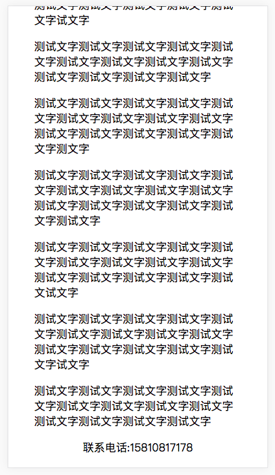

# sticky footer


> ## 效果



>## HTML代码

```
<div class="yiyi-sf">
	<div class="sf-content">
		<p>测试文字测试文字测试文字测试文字测试文字测试文字测试文字测试文字测试文字测试文字测试文字测试文字测试文字测试文字测试文字</p>
		<p>测试文字测试文字测试文字测试文字测试文字测试文字测试文字测试文字测试文字测试文字测试文字测试文字测试文字测试文字</p>
		<p>测试文RE字测试文字测试文字测试文字测试文字测试文字测试文字测试文字测试文字测试文字测试文字测试文字测试文字测试文字测试文字</p>
		<p>测试文字测试文字测试文字测试文字测试文字测试文字测试文字测试文字测试文字测试文字测试文字测试文字测试文字测试文字</p>
		<p>测试文字测试文字测试文字测试文字测试文字测试文字测试文字测试文字测试文字测试文字测试文字测试文字测试文字测试文字测试文字</p>
	<!-- 	<p>测试文字测试文字测试文字测试文字测试文字测试文字测试文字测试文字测试文字测试文字测试文字测试文字测试文字测试文字测试文字</p>
		<p>测试文字测试文字测试文字测试文字测试文字测试文字测试文字测试文字测试文字测试文字测试文字测试文字测试文字测试文字测文字</p>
		<p>测试文字测试文字测试文字测试文字测试文字测试文字测试文字测试文字测试文字测试文字测试文字测试文字测试文字测试文字测试文字</p>
		<p>测试文字测试文字测试文字测试文字测试文字测试文字测试文字测试文字测试文字测试文字测试文字测试文字测试文字测试文试文字</p>
		<p>测试文字测试文字测试文字测试文字测试文字测试文字测试文字测试文字测试文字测试文字测试文字测试文字测试文字测试文字试文字</p>
		<p>测试文字测试文字测试文字测试文字测试文字测试文字测试文字测试文字测试文字测试文字测试文字测试文字测试文字</p>
		<p>测试文字测试文字测试文字测试文字测试文字测试文字测试文字测试文字测试文字测试文字测试文字测试文字测试文字测试文字测试文字</p>
		<p>测试文字测试文字测试文字测试文字测试文字测试文字测试文字测试文字测试文字测试文字测试文字测试文字测试文字测试文字测文字</p>
		<p>测试文字测试文字测试文字测试文字测试文字测试文字测试文字测试文字测试文字测试文字测试文字测试文字测试文字测试文字测试文字</p>
		<p>测试文字测试文字测试文字测试文字测试文字测试文字测试文字测试文字测试文字测试文字测试文字测试文字测试文字测试文试文字</p>
		<p>测试文字测试文字测试文字测试文字测试文字测试文字测试文字测试文字测试文字测试文字测试文字测试文字测试文字测试文字试文字</p>
		<p>测试文字测试文字测试文字测试文字测试文字测试文字测试文字测试文字测试文字测试文字测试文字测试文字测试文字</p>
		<p>测试文字测试文字测试文字测试文字测试文字测试文字测试文字测试文字测试文字测试文字测试文字测试文字测试文字测试文字测文字</p>
		<p>测试文字测试文字测试文字测试文字测试文字测试文字测试文字测试文字测试文字测试文字测试文字测试文字测试文字测试文字测试文字</p>
		<p>测试文字测试文字测试文字测试文字测试文字测试文字测试文字测试文字测试文字测试文字测试文字测试文字测试文字测试文试文字</p>
		<p>测试文字测试文字测试文字测试文字测试文字测试文字测试文字测试文字测试文字测试文字测试文字测试文字测试文字测试文字试文字</p>
		<p>测试文字测试文字测试文字测试文字测试文字测试文字测试文字测试文字测试文字测试文字测试文字测试文字测试文字</p> -->
	</div>
	<div class="sf-footer">联系电话:15810817178</div>
</div>
```
> ## CSS代码
```
.yiyi-sf {
    height: 100%;
    .sf-content {
		overflow: hidden;
        width: 80%;
        margin: 0 auto;
        min-height: 100%;
        padding-bottom: 40px;
    }
    .sf-footer {
        margin-top: -40px;
        text-align: center;
    }
}

```
